# AzureML pipeline use and publish as an Endpoint

This is an end-to-end machine learning project on Microsoft Azure ML. Using the Bank Marketing Dataset, A Machine Learning model is trained, leveraging the AutoML feature of Azure. The model is deployed into production using Azure Container Instance (ACI) and consumed it using REST endpoints. An azureML pipeline is created, published and consumed as well.

## Architectural Diagram

Now this whole process has lot of component from creating and using a Service Principal, enabling the authentication, to using swagger for the API documentation to troubleshooting using the logs.  
We will discuss each step in detail, but the overall general idea of this project is listed in the diagram below.  

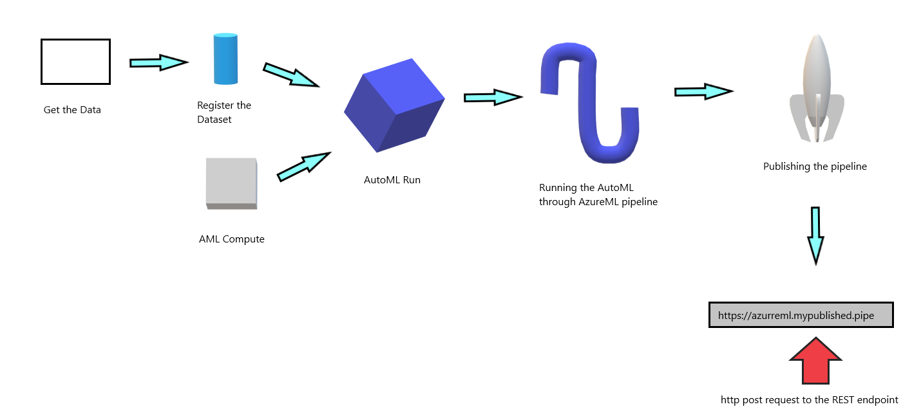

The central idea is an pipeline can be publised as an REST endpoint which can be triggered by authenticated user.  
Let's consider a scenario where we need to retrain our trained model, whenever new data is available. A process can automatically be trigger when new data is gathered in data store, and re-train the model with the help of an API call. No mannual intervention is requred for the whole training.  

## Key Steps

**Step 1** *creating a service principal* 
A service pricipal is one of the authentication method for azure [details](https://docs.microsoft.com/en-us/azure/active-directory/develop/app-objects-and-service-principals). A service principal can be given rbac access and the access can expire over a periord of time. Here we have created a Service Principal and given it access of an owner of the ML workspace.

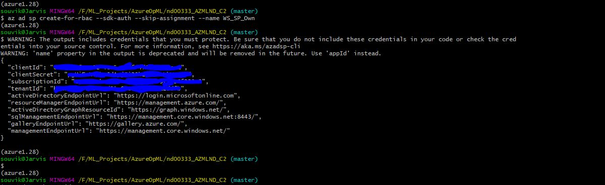

The command to share the workspace to the service principal with a role of owner.
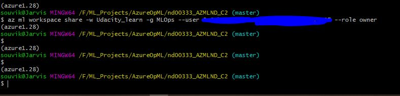

**Step 2** *Completing the experiment* 
The first step of machine learning is gathering of Data, in our case we have downloaded the data from a link and registed the Dataset.  
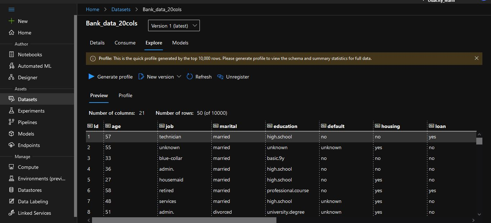
 
The experiment is run on AML Compute and it is completed after sometime.
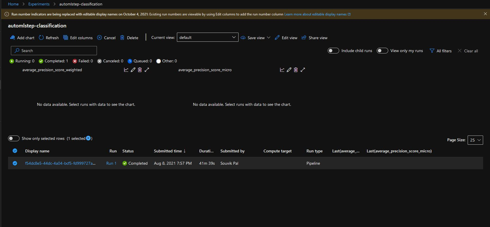
 
The best modcel came out as an Voting ensemble model.
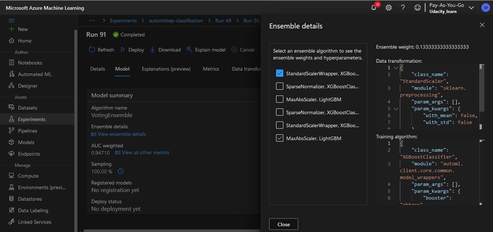
 
**Step 3** *Deploying the best model* 
We choose the best model for deployment and enable "Authentication" while deploying the model using Azure Container Instance (ACI). The executed code in logs.py enables Application Insights. "Application Insights enabled" was disabled before executing logs.py.
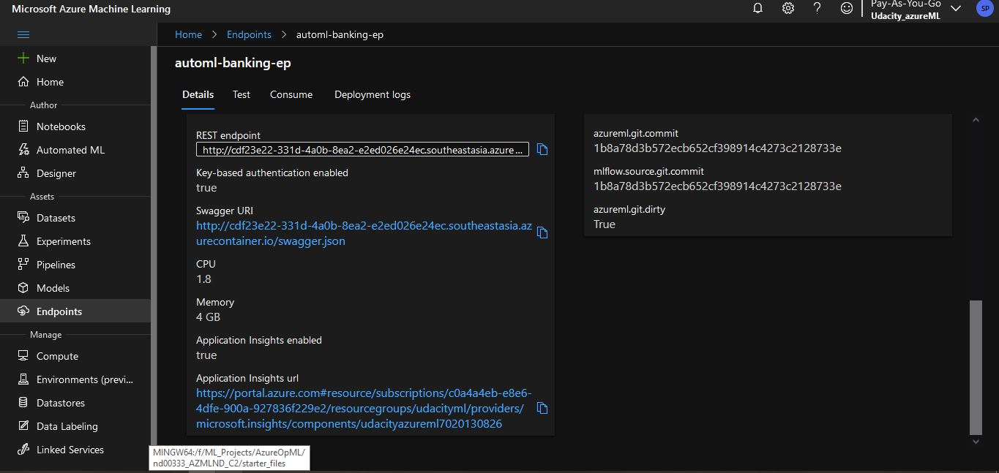
 
**Step 4** *Swagger Documentation* 
The Swagger documentation is fone of the most useful thing in the whole set up it gives Input and Output format of the deployed REST api. The swagger.json file is downloaded and swagger.py is run on a local host.
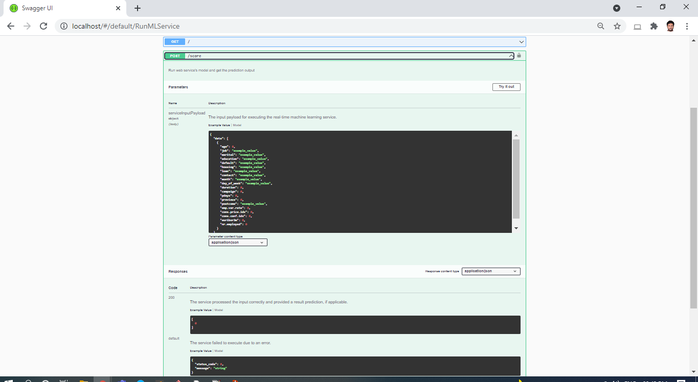
 
**Step 5** *Consuming the model endpoint*  
As we can see the exact post and response format from swagger, it is tome that we call that endpoint in same format to get result out of it. We have triggered endpoint.py with 2 records and got the results for those 2. 
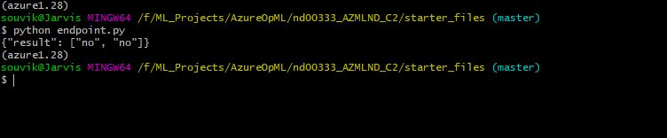
 
**Step 6** *Benchmarking the Above endpoint*  
We can check how fast our deployed service is using Azure Benchmark. The responsetime is more than suffficient for this simple model.
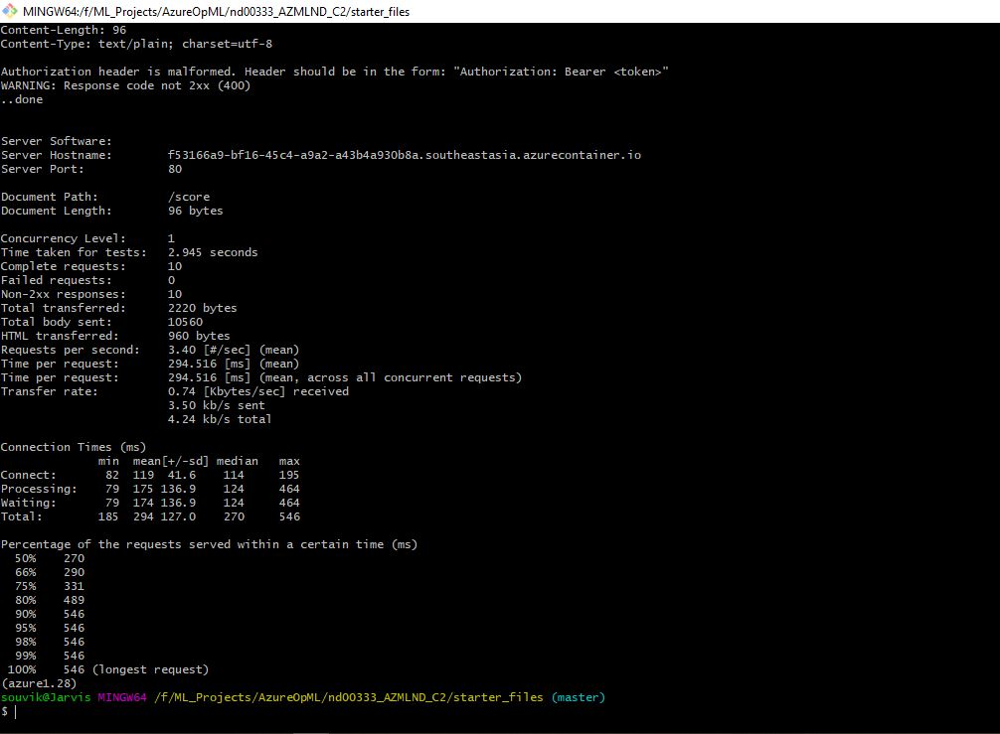
 
**Step 7** *Creating publishing and conduming the Pipeline*  
The notebook has been uploaded and ran and here are the screenshots below.
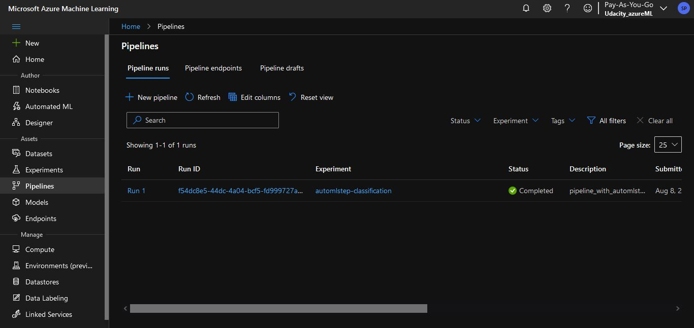
**The Pipeline endpoint with in active status**
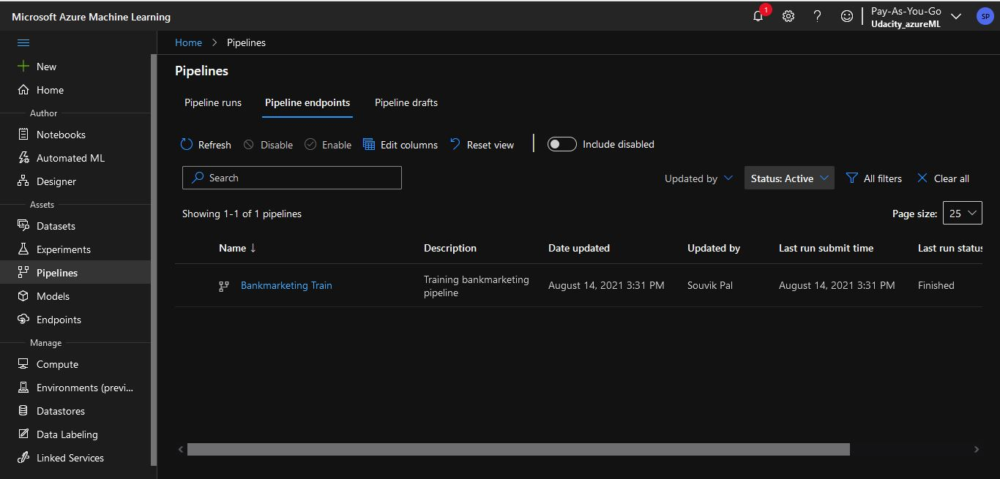
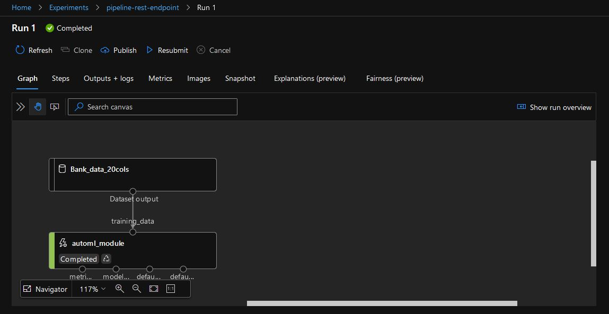

## Screen Recording
[Youtoube Screencast](https://youtu.be/z5YAJNxYWqc)

## Standout Suggestions
The suggestion would be we are only putting an AutoML step in the whole Pipeline. THe AutoML step uses a compute target which is created beforehand. Now if we trigger the pipeline it will succeed only if the Compute instance is running. 
 
Instead if we add another step in pipeline to create a Compute instance and then use than instance for AutoML then I think the whole Pipeline would have been more roboust.
